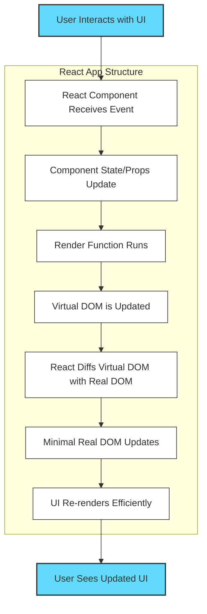

<p align="center">
  
</p>

<h1 align="center">🔷 What is React?</h1>

---

## 📚 What is a Library?

A **library** is a collection of pre-written code, functions, or routines that developers can use to perform common tasks. Libraries provide specific functionality that you can call upon in your own code as needed. The key point is that you are in control: you decide when and how to use the library.

- **Example:** React is a library for building user interfaces. You use its components and functions as you see fit within your application.
- **Analogy:** Think of a library as a toolbox—you pick the tools you need, when you need them.

## 🏗️ What is a Framework?

A **framework** is a comprehensive platform for building applications. It provides a structure and set of rules that dictate how your code should be organized and how different parts of your application interact. With a framework, the framework is in control and calls your code at certain points ("Inversion of Control").

- **Example:** Angular is a framework for building web applications. It dictates the structure and flow of your app.
- **Analogy:** A framework is like the blueprint and scaffolding for a building—you build within its structure and follow its rules.

---

## 📘 Introduction

**React** is a free and open-source front-end JavaScript library for building user interfaces, especially single-page applications where you need a fast, interactive user experience. Developed and maintained by Facebook (now Meta) and a community of individual developers and companies, React allows developers to create large web applications that can update and render efficiently in response to data changes.

---

## 🚀 Key Features

- **Component-Based Architecture:** Build encapsulated components that manage their own state, then compose them to make complex UIs.
- **Declarative UI:** Describe what you want to see on the screen, and React will update and render just the right components when your data changes.
- **Virtual DOM:** React creates a virtual representation of the UI in memory, which allows it to efficiently update the browser's DOM by only re-rendering components that actually change.
- **Unidirectional Data Flow:** Data flows down from parent to child components, making the app more predictable and easier to debug.
- **JSX Syntax:** JSX is a syntax extension for JavaScript that looks similar to HTML and makes writing React components more intuitive.
- **Rich Ecosystem:** Supported by a vast ecosystem of tools, libraries, and extensions (like React Router, Redux, etc.).

---

## 🕰️ History of React

- **2011:** React was created by Jordan Walke, a software engineer at Facebook. It was first deployed on Facebook's newsfeed.
- **2012:** React was used on Instagram, which was acquired by Facebook.
- **May 2013:** React was open-sourced at JSConf US. Its component-based approach and virtual DOM were revolutionary at the time.
- **2015:** Introduction of React Native, allowing developers to build native mobile apps using React.
- **2016-2017:** Major improvements, including the introduction of React Fiber (a new core algorithm for rendering), and the rise of functional components and hooks.
- **2019:** React Hooks were officially released, enabling state and side effects in functional components.
- **Present:** React is one of the most popular JavaScript libraries for building web and mobile applications, with a massive community and ecosystem.

---

## 🌟 Why Use React?

- **Performance:** Virtual DOM and efficient diffing algorithms make updates fast.
- **Reusability:** Components can be reused across different parts of an application.
- **Strong Community:** Extensive documentation, tutorials, and third-party libraries.
- **Backed by Meta:** Continuous improvements and long-term support.
- **Cross-Platform:** With React Native, you can build mobile apps for iOS and Android using the same concepts.

---

## 🏆 Advantages of React

- **Component-Based Architecture:** Encourages modular, maintainable, and reusable code.
- **Declarative Syntax:** Makes code more predictable and easier to debug.
- **Large Ecosystem:** Rich set of libraries, tools, and community support.
- **SEO Friendly:** Can be rendered on the server (with frameworks like Next.js) for better SEO.
- **Strong Backing:** Maintained by Meta and a large open-source community.
- **Learning Curve:** Easier to pick up compared to some full-fledged frameworks.
- **Rich Developer Tools:** Excellent debugging and development tools (React DevTools, etc.).
- **Cross-Platform Development:** Enables web and native mobile app development with shared concepts.

---

## ⚖️ Why React.js Over Vanilla JavaScript?

While Vanilla JavaScript (plain JavaScript without any libraries or frameworks) is powerful and flexible, building complex, interactive user interfaces with it can quickly become difficult to manage. Here’s why React.js is often preferred:

- **Component-Based Structure:** React lets you break your UI into reusable components, making code more organized and maintainable. In Vanilla JS, you often end up with tangled code and duplicated logic.
- **Declarative UI:** With React, you describe what you want the UI to look like, and React handles the updates. In Vanilla JS, you must manually manipulate the DOM, which is error-prone and hard to scale.
- **Efficient Updates:** React’s Virtual DOM ensures only the necessary parts of the UI are updated, improving performance. Vanilla JS updates the real DOM directly, which can be slow for large apps.
- **State Management:** React provides built-in ways to manage state and data flow. In Vanilla JS, managing state across a large app can become complex and buggy.
- **Ecosystem & Tooling:** React has a huge ecosystem of libraries, tools, and community support, making development faster and easier.

---

## 🛠️ Setting Up the React Development Environment

Follow these steps to set up your environment for React development:

1. **Install Node.js and npm**
   - Download and install from [nodejs.org](https://nodejs.org/).
   - Verify installation:
     ```bash
     node -v
     npm -v
     ```
2. **Install a Code Editor**
   - [Visual Studio Code](https://code.visualstudio.com/) is highly recommended.
3. **Install Git (optional but recommended)**
   - Download from [git-scm.com](https://git-scm.com/).
   - Useful for version control and collaborating on projects.
4. **Install React Developer Tools**
   - Available as a browser extension for Chrome and Firefox.
   - Helps debug and inspect React components.

You’re now ready to create and run React projects!

---

## 🗺️ React: Big Picture Overview

Below is a high-level overview of how React works, from user interaction to UI update:



---

<p align="center">
  <b>✨ React has transformed the way we build modern web and mobile applications. Dive in and start building amazing UIs! ✨</b>
</p>
