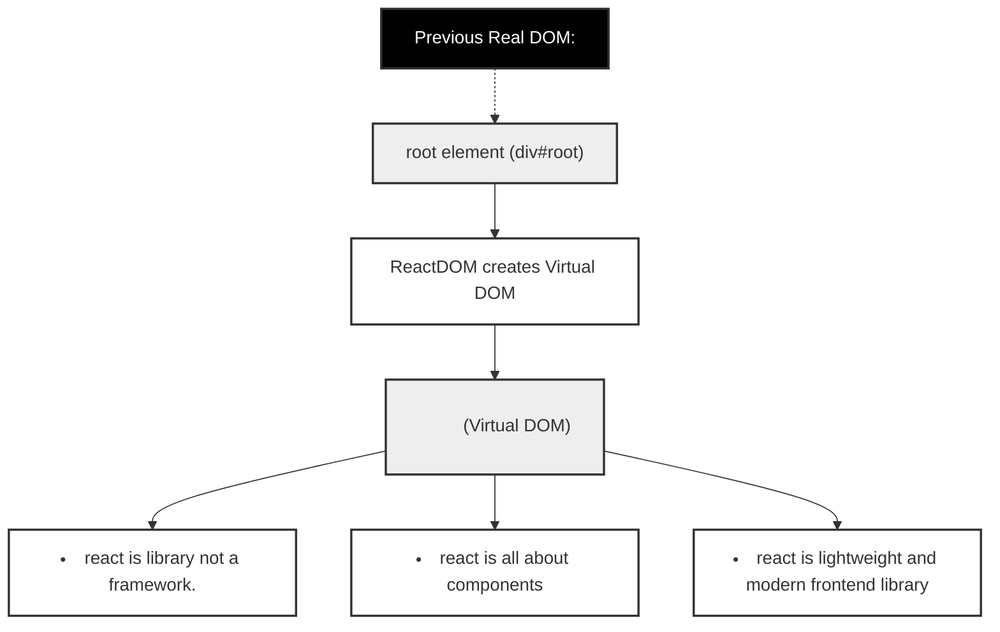

# 🧑‍💻 Day 003: Understanding React Under the Hood with CDN Scripts

This example shows how you can use React directly in the browser without any build tools (like Vite or Create React App). This helps you understand what happens "under the hood" in a React app.

## 📄 index.htm Explained Step-by-Step

### 1️⃣ The HTML Structure

```html
<div id="root"></div>
```

- This is the container where React will render your UI. It's just a normal HTML div with an id of "root".

### 2️⃣ Including React and Babel via CDN

```html
<script src="https://unpkg.com/react@18/umd/react.development.js"></script>
<script src="https://unpkg.com/react-dom@18/umd/react-dom.development.js"></script>
<script src="https://unpkg.com/@babel/standalone/babel.min.js"></script>
```

- **react.development.js**: Loads the React library.
- **react-dom.development.js**: Loads ReactDOM, which lets React render to the DOM.
- **babel.min.js**: Allows you to write JSX directly in the browser. Babel converts JSX to regular JavaScript.

### 3️⃣ Writing React Code with JSX in the Browser

```html
<script type="text/babel">
  const root = ReactDOM.createRoot(document.getElementById("root"));
  root.render(
    <>
      <h1>about react</h1>
      <ul>
        <li>react is library not a framework.</li>
        <li>react is all about components</li>
        <li>react is lightwieght and modern frontend library</li>
      </ul>
    </>
  );
</script>
```

- The `type="text/babel"` tells the browser to use Babel to compile the JSX.
- `ReactDOM.createRoot(document.getElementById("root"))` creates a React root attached to the div with id "root".
- `root.render(...)` renders your JSX (the `<h1>` and `<ul>`) into the root div.
- The `<>...</>` syntax is a React Fragment, which lets you return multiple elements without an extra wrapper div.

### 4️⃣ Why This is Useful

- **No build tools needed:** You can see how React works without any setup.
- **Great for learning:** Helps you understand the basics before moving to more complex setups like Vite or Create React App.
- **What happens under the hood:** This is similar to what Vite or CRA do for you automatically, but here you see every step.

---

## 🖼️ Visualizing the DOM and Virtual DOM

The diagram below shows how the root element, ReactDOM, the virtual DOM, and the real DOM relate to each other in this example:



---

## 🚀 Summary

- You can use React in the browser with just a few script tags and a root div.
- Babel lets you write JSX directly in the browser for learning and quick demos.
- For real projects, use a build tool (like Vite) for better performance and features.

---

Feel free to experiment by changing the JSX in the `<script type="text/babel">` block and see how React updates the UI instantly!
